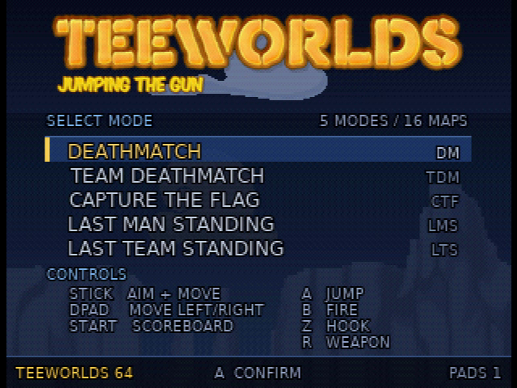
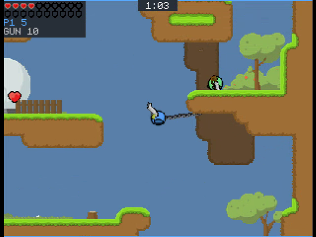
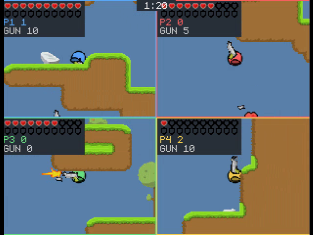

# Teeworlds 64

Teeworlds 64 is an unofficial, purpose-built offline adaptation of Teeworlds
for an Expansion Pak Nintendo 64. It currently provides deterministic bots,
one to four local players, split-screen rendering, the bundled DM/CTF/LMS
maps and modes, converted Teeworlds graphics and sound, and per-player Rumble
Pak feedback when the accessory is present.

The port compiles shared gameplay and server rules from a pinned
[`elohmeier/teeworlds`](https://github.com/elohmeier/teeworlds/tree/bots)
submodule. Target code lives here. A narrow patch is applied to a generated
copy during the build, leaving the submodule clean and making upstream update
conflicts explicit. Libdragon's upstream `preview` branch is also a pinned
submodule and is rebuilt in a digest-pinned toolchain container.

## Gameplay showcase

[](https://www.youtube.com/watch?v=ji8Y1ZodEts)

[Watch the v1.1.2 gameplay showcase on YouTube](https://www.youtube.com/watch?v=ji8Y1ZodEts).
It covers the menu, offline bots, all five game modes, several map themes, and
two-, three-, and four-player split screen. The footage was captured directly
from the ROM with Gopher64.

## Screenshots

Captured directly from the ROM with Gopher64.

### Main menu



### Gameplay

| Single player | Four-player split screen |
| --- | --- |
|  |  |

## Build

Clone recursively, install Python build dependencies, then build the pinned
toolchain and ROMs:

```sh
git clone --recursive https://github.com/elohmeier/tw64.git
cd tw64
python3 -m pip install -r requirements-build.txt
make image
make ci
```

Set `DOCKER=docker` when Docker is preferred over the default Podman:

```sh
make DOCKER=docker image ci
```

The build also needs CMake, a host C/C++ compiler, GNU Make, Git, Python 3,
and FFmpeg. `make ci` builds and structurally verifies:

- `teeworlds64.z64` — playable ROM
- `teeworlds64-s1.z64` and `teeworlds64-s2.z64` — non-interactive,
  deterministic regression fixtures

`dist/` contains only the playable ROM and its `SHA256SUMS` entry. The
simulation fixtures print and hash fixed matches without the playable menu or
renderer; CI verifies them, but releases do not publish them.

`make rom-all` additionally creates all unattended autoplay variants used for
local emulator and hardware qualification. Emulator throughput is automation
evidence only; real 50 Hz performance still needs emulator cycle measurements
and physical hardware validation.

## Releases and updates

Every pull request builds and verifies the playable ROM and both simulation
fixtures. A successful push to `main` runs semantic-release and publishes a
conventional-commit release with `teeworlds64.z64` and its checksum attached.
Use `feat:`, `fix:`, and breaking-change commit conventions to control
versioning.

Both upstream dependencies are immutable gitlinks. Dependabot proposes updates
to the `bots` and `preview` tips; each update must pass source patching, the
frozen host state hash, observation invariants, deterministic replay, and the
ROM build before merge.

## License

The source is provided under the Teeworlds zlib-style license in [LICENSE](LICENSE).
Teeworlds data has its own CC-BY-SA terms documented there, and libdragon's
license remains in its submodule. This project is an altered, unofficial port
and is not endorsed by the Teeworlds project or Nintendo.
